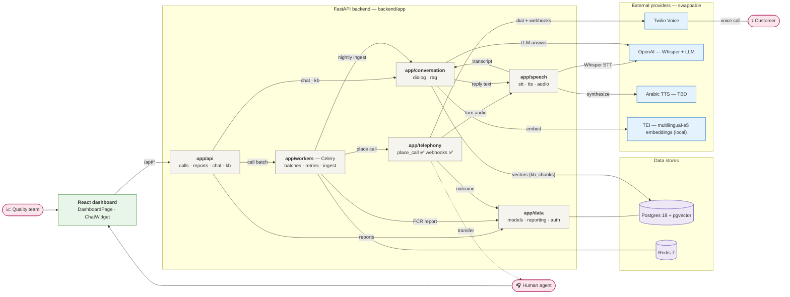
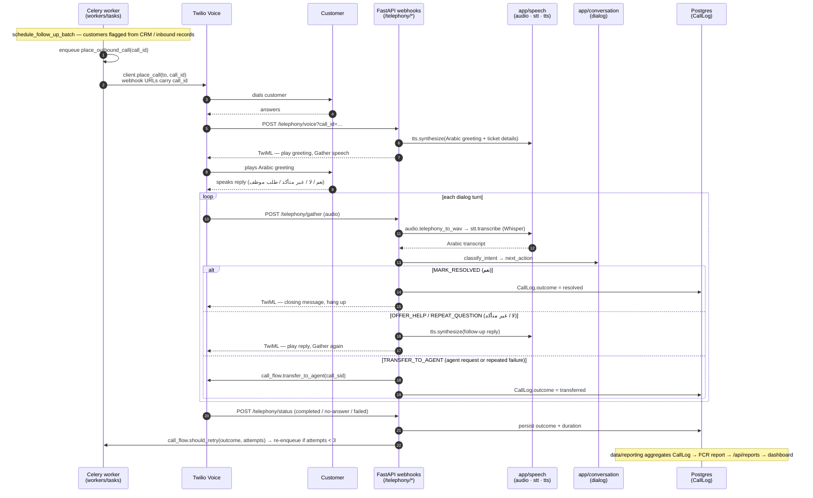
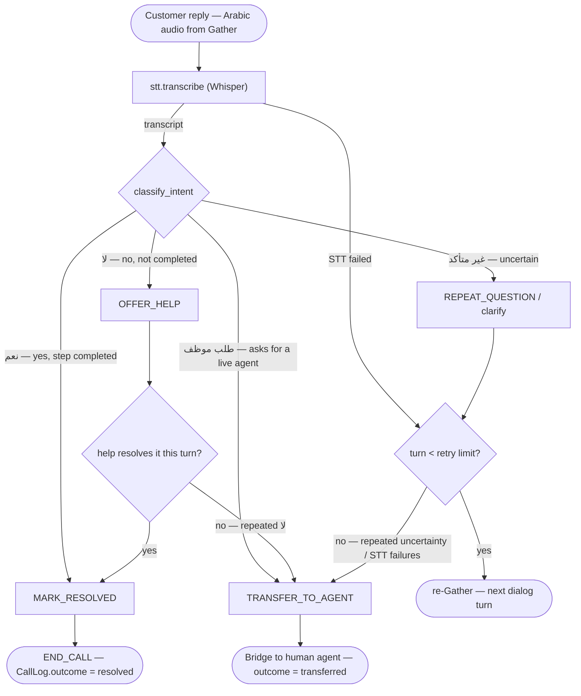
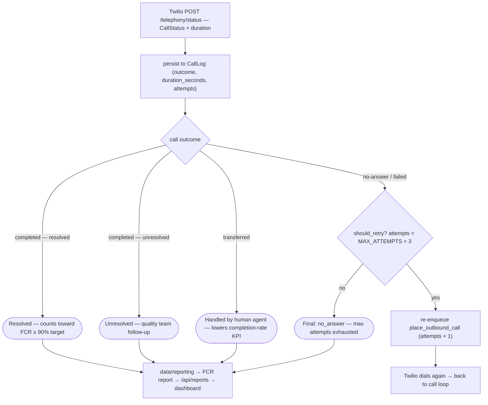
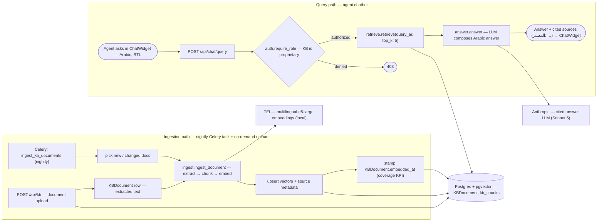

# CallCenter — System Model & Flowcharts

Architecture diagrams for the Arabic AI call-center platform. Diagrams are grounded in the code
under `backend/app/` as of 2026-07-09 — the repo is an early skeleton, so most boxes describe
**design intent** (stubs raising `NotImplementedError` / HTTP 501), not working code.

**Status legend used below**

| Marker | Meaning |
|---|---|
| ✅ | Implemented: `/health`, `telephony/client.place_call`, `POST /telephony/voice`, `POST /telephony/status` |
| ⏳ / dashed | Stub — signature and contract exist, body raises `NotImplementedError` or returns 501 |

> GitHub and the VS Code Markdown preview (with Mermaid support) render these blocks as diagrams.
> Ready-to-share exports (SVG + high-res PNG) of every figure live in [`docs/diagrams/`](diagrams/).

---

## 1. System architecture

One node per module: how the six backend modules, the React dashboard, the data stores, and the
external providers fit together, and how the two products (outbound follow-up calls, agent RAG
chatbot) share them. Provider SDKs stay behind module wrappers so every vendor is swappable.
Detail for each flow lives in figures 2–5.

---

## 2. Outbound follow-up call loop (sequence)

The end-to-end loop that crosses every module: Celery enqueues → Twilio dials → webhooks drive
each dialog turn through speech + dialog → outcome lands in `CallLog` → reporting aggregates it.
Today `/voice` plays a static `<Say>` greeting and `/gather` is a stub; the dynamic-TTS steps are
the target design.

---

## 3. Dialog decision tree

Design intent for `conversation/dialog.py` (`classify_intent` / `next_action` are stubs): the
four intents map to actions, with repeated لا / غير متأكد replies or STT failures escalating to a
human agent per `call_flow.transfer_to_agent`'s contract.

---

## 4. Call outcome & retry policy

What happens after Twilio posts the final status to `/telephony/status`. Retry policy lives in
`telephony/call_flow.py` (`MAX_ATTEMPTS = 3`); every terminal outcome feeds `data/reporting.py`
and its KPI targets (FCR ≥ 90%, completion rate vs. live-agent baseline).

---

## 5. RAG knowledge-base loops

The agent-facing chatbot's two paths. Ingestion runs nightly (Celery) and on upload via
`/api/kb`; queries flow through the role guard (KB content is proprietary) to retrieval and
cited answer generation — citations are a hard requirement.

