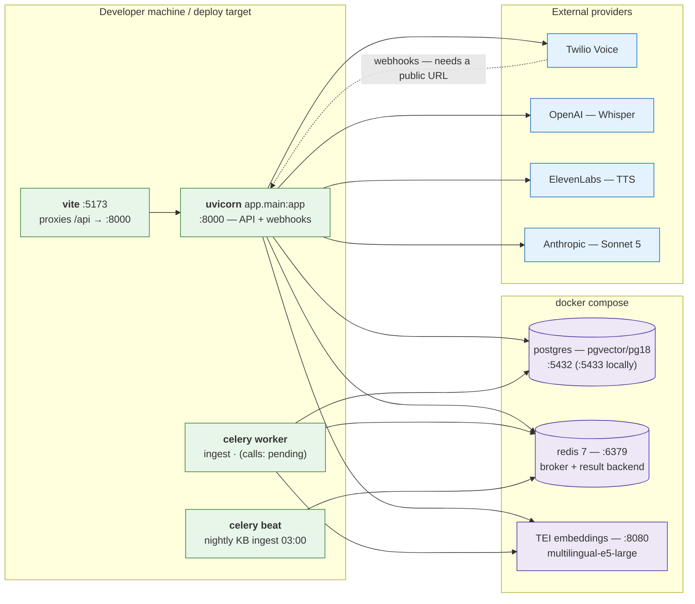
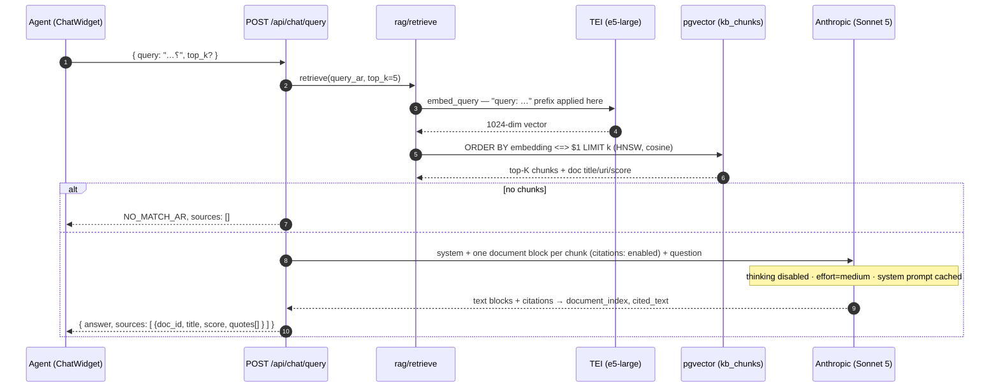
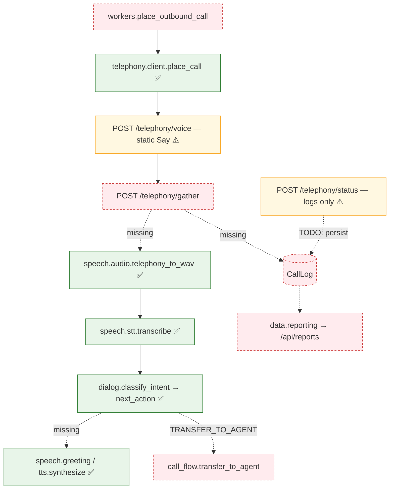
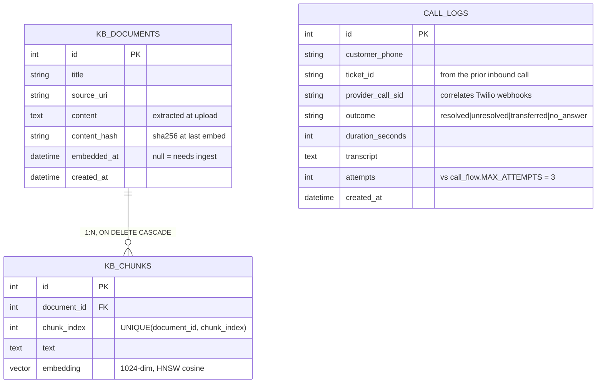

# CallCenter — Implementation Guide

How the system is **built today**, module by module: what runs, what it talks to, and which
decisions are load-bearing. Companion to [architecture.md](architecture.md), which describes the
*target* design — where the two disagree, this document wins.

Grounded in `backend/app/` and `frontend/src/` as of 2026-07-14 (236 tests passing).

---

## 1. Status at a glance

| Module | Component | State | Notes |
|---|---|---|---|
| **speech** | `stt.transcribe` | ✅ | OpenAI Whisper, `language="ar"`, in-domain prompt bias |
| | `tts.synthesize` | ✅ | ElevenLabs over `httpx` (no SDK), `eleven_multilingual_v2` |
| | `greeting.render_greeting` | ✅ | Composes the Arabic opener from prior-call context |
| | `audio.telephony_to_wav` / `wav_to_telephony` | ✅ | stdlib `audioop` + `wave` — **no ffmpeg dependency** |
| **conversation** | `dialog.classify_intent` / `next_action` | ✅ | Rule-based, dialect-tolerant, escalation ladder |
| | `rag/` extract · chunk · embed · store · retrieve · answer | ✅ | Full pipeline, citations enforced structurally |
| **telephony** | `client.place_call` | ✅ | Dials a real call — never smoke-test it |
| | `POST /telephony/voice` | ⚠️ | Static `<Say>` greeting; not yet fed by `speech.tts` |
| | `POST /telephony/status` | ⚠️ | Logs the final status; **does not persist to `CallLog`** |
| | `POST /telephony/gather` | ❌ | `NotImplementedError` — the missing link (§4) |
| | `call_flow.should_retry` / `transfer_to_agent` | ❌ | Stubs; `MAX_ATTEMPTS = 3` is fixed |
| **data** | `models` + Alembic `0001` | ✅ | `CallLog`, `KBDocument`, `KBChunk` (pgvector) |
| | `reporting` (FCR, completion, AHT) | ❌ | Stubs |
| | `auth` (OAuth2 + RBAC) | ❌ | Stubs — **`/api/chat` and `/api/kb` are unauthenticated** |
| **workers** | `ingest_kb_document(s)` | ✅ | On-upload + nightly beat at 03:00 |
| | `schedule_follow_up_batch`, `place_outbound_call`, `generate_fcr_report` | ❌ | Stubs |
| **api** | `POST /api/chat/query` | ✅ | Cited Arabic answers |
| | `POST/GET /api/kb/documents` | ✅ | Upload → extract → enqueue embed |
| | `/api/calls/*`, `/api/reports/*` | ❌ | HTTP 501 |
| **frontend** | Dashboard + `ChatWidget` | ❌ | Static shells; no API calls wired |

**Net position.** The **RAG product is functionally complete end-to-end** (upload → embed →
retrieve → cited answer) and only lacks its UI and auth guard. The **outbound-call product has
every part built except the wiring**: speech, dialog, and dialing all work in isolation, but
nothing joins them, because `/telephony/gather` — the handler that would call them — is a stub.

---

## 2. Runtime topology

Four processes and three containers. Everything is stateless except Postgres.

Twilio must reach `/telephony/*` over the public internet: `PUBLIC_BASE_URL` has to point at a
tunnel (ngrok/cloudflared) in development — see the `test-call-flow` skill.

---

## 3. The RAG pipeline (implemented)

### Ingestion

`POST /api/kb/documents` extracts text synchronously (so a bad upload fails fast with 415/400),
persists a `KBDocument`, and enqueues embedding **best-effort** (`retry=False`) — a dead broker
logs a warning instead of blocking the request, because the nightly beat job is the guaranteed
path. `ingest.ingest_document` then chunks, embeds, and swaps the document's chunks wholesale,
stamping `embedded_at` + `content_hash` **in the same transaction** so a crash can't leave a
document marked-embedded with no vectors.

Re-ingestion is content-addressed: `docs_needing_embedding` re-picks a document only when
`content_hash` no longer matches `sha256(content)`, so the nightly job is idempotent and cheap.

`chunking.chunk_text` is structure-aware — it splits along the finest structure that fits
(paragraphs → lines → sentences → words → fixed windows), and seeds each chunk's overlap at a
sentence or word boundary, so a chunk never opens mid-word. Sizes are in **characters**, not
tokens, which keeps the module free of a tokenizer dependency (1500 chars ≈ 400–500 Arabic tokens).

### Query — and why citations can't be faked

Citations are a hard product requirement, so they are **not prompted for**. Asking a model to
write `(المصدر: …)` inline lets it invent a source. Instead each retrieved chunk is sent as its
own `document` block with the Anthropic **Citations API** enabled; the model returns citation
objects bound to exact character spans of the passages we supplied, and `answer._sources`
resolves `document_index` back to a `KBDocument`. **A citation therefore cannot name a document
that was never retrieved** — the guarantee is structural, not behavioural.

Two contracts worth internalising:

- **`sources: []` means "the KB does not cover this"** — never treat the answer text as an
  uncited fact. Callers (and the widget) must render it as a not-covered notice.
- **e5 prefixes (`query:` / `passage:`) are applied inside `rag/embeddings.py`** — never at call
  sites. Mixing them up silently degrades retrieval with no error.

Retrieval uses an HNSW index with `vector_cosine_ops` (migration `0001`, Postgres only).
`score` is returned as cosine *similarity* (`1 - distance`), so higher is better.

---

## 4. The call loop — and the gap in it

Every box below exists and is tested. The **red edges do not exist**: `/telephony/gather` raises
`NotImplementedError`, so audio never reaches STT, dialog never runs, and `CallLog` is never
written. This is the critical path for the outbound product.

**To close it, in order:** `/gather` (audio → STT → dialog → TwiML) → `call_flow` (retry +
transfer) → `CallLog` persistence in `/status` → `place_outbound_call` → `reporting` → dashboard.

### Dialog engine (implemented)

`conversation/dialog.py` is deliberately **rule-based and dependency-free** — no API key, no
network, so it runs inside a webhook that must answer fast (Twilio retries on timeout). The
requirements doc targets an LLM classifier; when that lands, the phrase tables become its
regression suite (23 tests already pin the behaviour).

Three decisions carry the accuracy:

1. **Normalization before matching.** Egyptian STT output is orthographically noisy — diacritics
   come and go, hamza carriers vary, taa marbuta is written both ways. Everything is folded to a
   canonical form first, and phrase tables are written in natural orthography and normalized at
   import (never hand-folded).
2. **Word-bounded matching, not substring.** `اه` (yes) occurs inside dozens of unrelated words
   and `نعم` sits inside `نعمة`. Patterns are compiled with lookaround boundaries.
3. **Negation guards.** `مش تمام` contains `تمام`; `معملتش` is `عملت` wearing the Egyptian ما…ش
   circumfix. Without the guard, a widened YES table swallows negated replies — and a false
   `MARK_RESOLVED` corrupts the FCR report, which is why classification **never falls back to
   YES**; unusable speech maps to `UNKNOWN`.

Intent → action is an escalation ladder, and every dead end routes to a human:

| Intent | Turn 0 | Turn 1 | Turn ≥ 2 (`ESCALATE_TURN`) |
|---|---|---|---|
| `YES` | `MARK_RESOLVED` | `MARK_RESOLVED` | `MARK_RESOLVED` |
| `AGENT` | `TRANSFER_TO_AGENT` | ← | ← |
| `NO` | `OFFER_HELP` | `TRANSFER_TO_AGENT` | `TRANSFER_TO_AGENT` |
| `UNCERTAIN` | `REPEAT_QUESTION` | `OFFER_HELP` | `TRANSFER_TO_AGENT` |
| `UNKNOWN` | `REPEAT_QUESTION` | `REPEAT_QUESTION` | `TRANSFER_TO_AGENT` |

`next_action` is pure — the caller owns incrementing `state.turn`.

### Audio path (implemented)

Twilio carries 8 kHz mu-law; Whisper wants 16 kHz linear-PCM WAV. That exact pair is handled by
the standard library (`audioop` + `wave`), so `speech/audio.py` uses stdlib rather than pydub —
**dropping the ffmpeg-on-PATH requirement** from the call loop and CI. (Caveat: `audioop` is
removed in Python 3.13; the project targets 3.11. Revisit with `audioop-lts` if we upgrade.)

The conversion can be bypassed entirely: set `ELEVENLABS_OUTPUT_FORMAT=ulaw_8000` and TTS returns
Twilio-ready audio directly.

---

## 5. Data model

Migration `0001` is hand-written and **runs on both Postgres and SQLite** — Postgres-only
statements (`CREATE EXTENSION vector`, the HNSW index, the `Vector` column type) are guarded on
the dialect, with `JSON` as the SQLite variant. That is what lets the whole suite run in CI with
no database container. `tests/test_migrations.py` enforces model↔migration parity, and every
`models.py` change ships its migration in the same PR (`db-migrate` skill).

`EMBEDDING_DIM = 1024` is duplicated in `models.py`, the migration, and
`settings.embedding_dimensions` — changing the embedding model means a new migration **and a full
re-ingest**.

---

## 6. Configuration

All config flows through `app/config.py` (`from app.config import settings`); **no module reads
`os.environ`**. A new key means a `Settings` field + a `.env.example` entry (+ a docker-compose
service if it is infra).

| Group | Keys | Notes |
|---|---|---|
| Stores | `DATABASE_URL`, `REDIS_URL` | Local override publishes Postgres on **:5433** |
| STT | `OPENAI_API_KEY`, `STT_MODEL`, `STT_PROMPT_AR` | `STT_PROMPT_AR` biases decoding toward Egyptian spelling — the main accuracy lever |
| TTS | `TTS_API_KEY`, `ELEVENLABS_*` (voice, model, format, normalization, pronunciation dict, tuning) | Text normalization is on so ticket IDs are read naturally, not digit-by-digit |
| RAG | `TEI_URL`, `EMBEDDING_DIMENSIONS`, `RAG_CHUNK_SIZE/OVERLAP/TOP_K` | TEI runs locally; no vector-DB SaaS |
| Answers | `ANTHROPIC_API_KEY`, `ANSWER_MODEL`, `ANSWER_MAX_TOKENS`, `ANSWER_EFFORT` | `effort=medium` measured **better *and* cheaper** than `low`, which stitched near-verbatim quotes and restated steps (207 vs 146 output tokens) |
| Telephony | `TWILIO_*`, `PUBLIC_BASE_URL` | Twilio sells no Egyptian (+20) numbers — use a supported-country number or a verified caller ID |
| Auth | `JWT_SECRET`, `JWT_ALGORITHM` | Unused until `data/auth.py` lands |

Provider SDKs stay behind their module's wrapper (`stt`, `tts`, `client`, `embeddings`, `answer`)
so vendors remain swappable — Pinecone was already swapped for pgvector, and TTS deliberately
uses raw `httpx` rather than the ElevenLabs SDK for the same reason.

---

## 7. Tests

236 tests, no network and no database container: providers are monkeypatched at the module
boundary (`ingest` calls collaborators as module attributes precisely so tests can patch them in
one place), and SQLAlchemy runs against SQLite via the dialect-guarded migration.

| Area | Files | Focus |
|---|---|---|
| Dialog | `test_dialog.py` | Dialect coverage, negation, escalation ladder — the largest suite, and the regression net for a future LLM classifier |
| RAG | `test_rag_{extract,chunking,embeddings,retrieve,ingest,answer}.py` | Chunk boundaries, e5 prefixing, transaction atomicity, citation resolution (incl. out-of-range and refusal paths) |
| Speech | `test_speech_{stt,tts,greeting,audio}.py` | Round-trip audio conversion, request shaping, empty-input contracts |
| API/infra | `test_{health,chat_api,kb_api,telephony,workers,migrations}.py` | Route contracts, TwiML, model↔migration parity |

CI (`.github/workflows/ci.yml`) runs `ruff check` + `pytest` (backend) and `tsc --noEmit` +
`vite build` (frontend). Both job names are required status checks — keep them stable.

---

## 8. Known gaps

Ordered by risk, not by sprint.

1. **`/api/chat` and `/api/kb` are unauthenticated.** KB content is proprietary and these routes
   expose it to anyone who can reach the API. `data/auth.py` is a stub; the `require_role` guard
   is a `TODO` in `api/chat.py`. **Do not deploy publicly until this lands.**
2. **The call loop is not wired** (§4) — `/gather`, `call_flow`, and `CallLog` persistence.
3. **No reporting.** `data/reporting.py` is stubs, so the FCR report — the product's headline
   deliverable — has no implementation, and `/api/reports/*` returns 501.
4. **Frontend is a shell.** Neither the dashboard nor `ChatWidget` calls the API, so the working
   RAG backend has no user.
5. **Whisper accuracy is untuned.** `STT_PROMPT_AR` is empty; it should be seeded against real
   Egyptian test-call recordings.
6. **Scanned Arabic PDFs extract sparsely** — `pypdf` has no OCR. Accepted for now; re-export
   such documents as text/DOCX.

---

## 9. Working on this repo

- **Skills** (`.claude/skills/`) cover the recurring workflows: `run-stack` (launch + health-check
  the dev stack), `verify` (verify a change end-to-end), `test-call-flow` (simulate the Twilio
  loop, Arabic intent phrases, tunnel setup), `db-migrate` (Alembic per-change migrations).
- **Process** is binding — see [CONTRIBUTING.md](../CONTRIBUTING.md): never commit to `main`,
  branch as `<module>/<short-desc>`, Conventional Commits, green CI + one review, and PR
  descriptions state how the change was verified.
- **Module ownership**: keep new code inside its owning module and call across modules through
  their public functions. Customer/agent-facing text is Arabic; code, comments, and logs are
  English.
- ⚠️ `client.place_call` dials a real number and bills a real account. **Never smoke-test it.**
